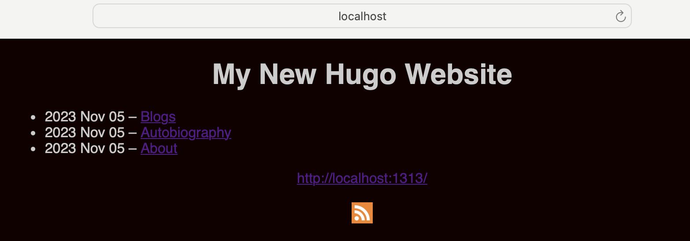
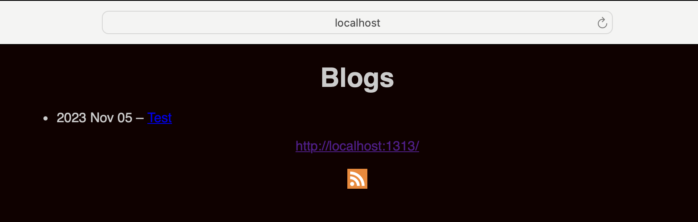
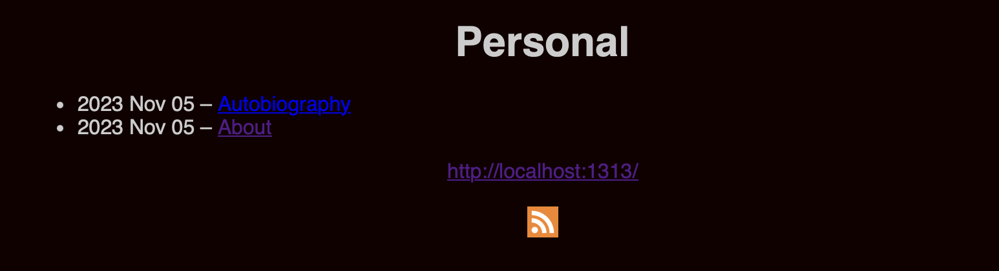

# intro-hugo
#hugo
#getting-started

This is a beginners guide that explains how to use hugo for static sites. 

These notes are from my learnings while watching Luke Smith's video https://youtu.be/ZFL09qhKi5I?feature=shared

Download Hugo: https://gohugo.io

## Getting started

1. Copy my repo into a local directory and setup a new site.
```bash
git clone git@github.com:labeveryday/hugo-learning.git && cd hugo-learning
hugo new site new-site
```

2. Once the hugo site is setup here are the files and directories that are installed. 
```bash
>tree -l                                                                                                                      
.
├── archetypes
│   └── default.md
├── assets
├── content
├── data
├── hugo.toml
├── i18n
├── layouts
├── static
└── themes

9 directories, 2 files
```

3. In order to get started you will need a theme. Follow these steps to download a theme.
```
cd new-site
git clone https://github.com/lukesmithxyz/lugo themes/lugo
```

4. Here we verify the theme has been downloaded into the right directory.
```bash
tree -l                                                                                                             
.
├── archetypes
│   └── default.md
├── assets
├── content
├── data
├── hugo.toml
├── i18n
├── layouts
├── static
└── themes
    └── lugo
        ├── README.md
        ├── archetypes
        │   └── default.md
        ├── config.toml
        ├── layouts
        │   ├── _default
        │   │   ├── baseof.html
        │   │   ├── list.html
        │   │   ├── rss.xml
        │   │   └── single.html
        │   ├── partials
        │   │   ├── nav.html
        │   │   ├── nextprev.html
        │   │   └── taglist.html
        │   └── shortcodes
        │       ├── hidvid.html
        │       ├── img.html
        │       ├── tagcloud.html
        │       └── vid.html
        └── static
            ├── rss.svg
            └── style.css

16 directories, 18 files
```

5. After downloading theme you will need to tell hugo which theme to use.
```
echo "theme = 'lugo'" >> hugo.toml
```

6. Finally, you will have to copy the example CCS file from theme to the website so you can customize it. 
```
cp themes/lugo/static/style.css static/
```

At this point the site is ready. 

You can test a real-time generated site with: `hugo server -D --noHTTPCache`

___

## Understanding Hugo directories

### archetypes
If  you use `hugo new` this is the template for what it creates. You can modify if the file is a draft, what tags are added, the date, and other things:

```markdown
# arhectypes/draft.md

+++
title = '{{ replace .File.ContentBaseName "-" " " | title }}'
date = {{ .Date }}
draft = true
+++
```


**Example:**

From cli: `hugo new new-blog-post.md`

Notice the file that was created:
```bash
tree -l                                                                        
.
├── archetypes
│   └── default.md
├── assets
├── content
│   ├── about.md
│   ├── autobiography.md
│   └── new-blog-post.md    <---- new file
```

If we view the contents in the file:
```markdown
# content/new-blog-post.md

+++
title = 'New Blog Post'
date = 2023-11-05T08:06:35-05:00
draft = true
+++
```

>NOTE: This will create a draft if we 
### Content
Where you store your content (Markdown files) and blogs

### Static
Directory where you place all the files that are not webpages. 
- i.e. css files, images, documents you want people to download

### Themes
Where you place themes that you want to use.

### hugo.toml
Configuration file for the site. 

### public
When you are done editing and you want to publish. You run `hugo` and it will generate the site into the public directory

____

## Creating files

1. To create a new about page from the cli: 
```bash
hugo new about.md
```

>NOTE: This will automatically create the markdown file in the *site/content/* directory. 

2. Open the file and notice that this automatically adds the title, date, and draft section:
```markdown
+++
# about.md

title = 'About'
date = 2023-11-05T07:40:46-05:00
draft = true
+++
```

3. Once you have your file you can enter text, lists, dictionary definitions, numbered list, images and everything that you can do in markdown. 
```markdown
Here is some content. This is all in Markdown.

- List item
- asdfghjkl
- lkjhgfdsa

Dictionary
: Dictionary definitions 

1. asdf
2. asdf
```

4. When the file is created you will see `draft = true` to see new page on your site you can either delete the line or set `draft = false`.


## Creating directories

Hugo will automatically structure the URL links when you add new directories and files in the content directory.

1. Here we create a new directory called blogs:
```bash
mkdir ./content/blogs
```

2. Then we create a new file in that directory
```bash
hugo new ./blogs/test.md 
```

3. We add a line of text to the file:
```
echo "This is my new blog site" >> ./content/blogs/test.md
```

4. When we go to the site notice there is a new localhost/blogs/test directory and site: 







>NOTE: If this does not work you may have to restart the site.

## Adding tags

1. In the about.md file you will add a line for tags and then enter the tags as a list

```markdown
# about.md

title = 'About'
date = 2023-11-05T07:40:46-05:00
draft = false
tags = ['updates', 'personal']
```

>NOTE: When you click on a tag Hugo will list all related posts to the tag automatically

2. Create a new file: `hugo new autobiography.md`
3. Add text to the file: `echo 'This is my autobiography' >> ./content/autobiography.md`
4. In the file add tags: 
```markdown
# autobiography.md

+++
title = 'Autobiography'
date = 2023-11-05T07:55:17-05:00
draft = false
tags = ['personal']
+++
```

5. Now when you click on the tags you will see each post that has that relevant tag:



## Linking to pages

1. In a content/ file you can link to other pages by using ``[enter a name](/filename)`
```markdown
# about.md
+++
title = 'About'
date = 2023-11-05T07:40:46-05:00
draft = false
tags = ['updates', 'personal']
+++

Here is some content. This is all in Markdown.
- List item
- asdfghjkl
- lkjhgfdsa
 
Dictionary
: Dictionary definitions

Numbered list
1. asdf
2. asdf

See my [Test page](/blogs/test)
```

>NOTE: you do not need to include `.md`

## Including images

To include things like images you will use the static folder. When hugo compiles it takes the static directory and the content directory and puts everything into the root directory:

1. cp an images to the `./static/` directory
2. In the content file you then add a file that states `

When creating a list of pages for your site you will create a `_index.md` file.

1. In the content/ directory create a `_index.md` file and then add your text.
2. This inside the `_index.md` file you add your text:
```markdown
+++
title = "This is my homepage"
date = 2023-11-05T10:00:41-05:00
draft = false
+++

This is my homepage where I list all of my content.
```

## Layouts

Inside of `./themes/lugo/layouts` you will find `archetypes/`, `layouts/` and `static/` these are default location for your website theme files. If you create one of these `_default.md` files in the folders of your site's root `archetypes/`, `layouts/` or `static/` directory it will over write the defaults in the theme.

**Learning the `themes/lugo/layouts/_default/` directory**
In hugo there are two different types of pages. These are templates for what lists and singles look like. The home page is a list:
- `single.html` --> blog posts and about pages
- `list.html` --> Pages that list pages

Reviewing `single.html`:
```html
<!--  Partial calls a header.html file from the partials directory so the header in every file is exactly the same -->
{{ partial "header.html" . -}} 
<header><h1>{{ .Title }}</h1></header>
<article>
<!--  Returns the rendered content of the given page. -->
{{ .Content -}}
<!--  Partial calls a footer.html file from the partials directory so the footer in every file is exactly the same -->
{{ partial "footer.html" . }}
```

>NOTE: The footer and the headers partials are exactly the same in the `single.html` and the `list.html`

#hugo-variables
For information on [hugo variables](https://gohugo.io/variables/)

Reviewing `list.html` 
- Modifying this file will change how pages are listed on a `_index.md` list page.
```html
<!-- Partial calls a header.html file from the partials directory so the header in every file is exactly the same -->
{{ partial "header.html" . -}} 
<header><h1>{{ .Title }}</h1></header>
<article>
<!-- Returns the rendered content of the given page. -->
{{ .Content -}}
<!--  List that loops through all pages and outputs the -->
<ul>
{{- range.Pages }}
<li>
<a href="{{ .RelPermalink }}">{{ .Title }}</a>
	<!-- Adding a summary to an article -->
	{{ .Sumamry }}
</li>
{{end}}
</ul>
</article>
<!--  Partial calls a footer.html file from the partials directory so the footer in every file is exactly the same -->
{{ partial "footer.html" . }}
```

## Adding rss

To add RSS here is the template:
```xml
<rss version="2.0" xmlns:atom="http://www.w3.org/2005/Atom">
  <channel>
	<title>{{ .Site.Title }}</title>
	<link>{{ .Permalink }}</link>
	<description>Recent content {{ if ne  .Title  .Site.Title }}{{ with .Title }}in {{.}} {{ end }}{{ end }}on {{ .Site.Title }}</description>
	<generator>Hugo -- gohugo.io</generator>{{ with .Site.LanguageCode }}
	<language>{{.}}</language>{{end}}{{ with .Site.Author.email }}
	<managingEditor>{{.}}{{ with $.Site.Author.name }} ({{.}}){{end}}</managingEditor>{{end}}{{ with .Site.Author.email }}
	<webMaster>{{.}}{{ with $.Site.Author.name }} ({{.}}){{end}}</webMaster>{{end}}{{ with .Site.Copyright }}
	<copyright>{{.}}</copyright>{{end}}{{ if not .Date.IsZero }}
	<lastBuildDate>{{ .Date.Format "Mon, 02 Jan 2006 15:04:05 -0700" | safeHTML }}</lastBuildDate>{{ end }}
    {{ with .OutputFormats.Get "RSS" }}
        {{ printf "<atom:link href=%q rel=\"self\" type=%q />" .Permalink .MediaType | safeHTML }}
	{{ end }}
	{{ range .Site.RegularPages }}
	<item>
		<title>{{ .Title }}</title>
		<link>{{ .Permalink }}</link>
		<pubDate>{{ .Date.Format "Mon, 02 Jan 2006 15:04:05 -0700" | safeHTML }}</pubDate>
		{{ with .Site.Author.email }}<author>{{.}}{{ with $.Site.Author.name }} ({{.}}){{end}}</author>{{end}}
		<guid>{{ .Permalink }}</guid>
		<description>{{- .Content | html -}}</description>
	</item>
	{{ end }}
	</channel>
</rss>

```

## Understanding Partials and Shortcodes

You call partials in templates and you call shortcodes in files. 
- shortcode allows you to write a template and plug in 


